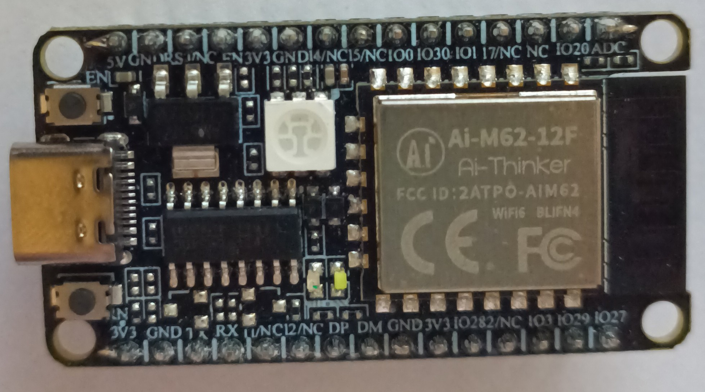

.. _ai_m62_12f:

BL616 Development Board
#######################

Overview
********

BL616/BL618 is Wi-Fi 6 + Bluetooth 5.3 + 802.15.4(Zigbee/Thread) combo chipset for ultra-low-power
applications.
Peripheral interfaces include USB2.0, SDIO, Ethernet, SD/MMC, SPI, UART, I2C, I2S, PWM, GPDAC,
GPADC, Audio,
ACOMP and GPIOs. Flexible GPIO configurations are supported. BL616 has total 19 GPIOs and BL618 has
total 35 GPIOs.
BL616 uses T-Head E907 Core, furnished with 532KB of ram, and a embedded 4MB of flash for the
Ai-thinker M62 module.

Hardware
********

For more information about the Bouffalo Lab BL-602 MCU:

- `Bouffalo Lab BL616 MCU Datasheet`_
- `Bouffalo Lab Development Zone`_
- `ai_m62_12f Schematics`_

Supported Features
==================

The board configuration supports the following hardware features:

+-----------+------------+-----------------------+
| Interface | Controller | Driver/Component      |
+===========+============+=======================+
| MTIMER    | on-chip    | RISC-V Machine Timer  |
+-----------+------------+-----------------------+
| PINCTRL   | on-chip    | pin muxing            |
+-----------+------------+-----------------------+
| UART      | on-chip    | serial port-polling   |
+-----------+------------+-----------------------+

The default configurations can be found in the Kconfig
:zephyr_file:`boards/bouffalolab/bl61/ai_m62_12f/ai_m62_12f_defconfig`.

System Clock
============

The BL616 can run at multiple frequencies, it runs at 320Mhz by default.

Serial Port
===========

The ai_m62_12f_ uses UART0 as default serial port.  It is connected to
USB Serial converter and port is used for both program and console.

Programming and Debugging
*************************

BL Flash tool
=============

The BL-616 have a ROM bootloader that allows user flash device by serial port.
The bflb-mcu-tool tool, provided by the pip package of the same name, enables flashing the devices.

Debugging
=======

#. Jtag defaults for BL616/BL618 are as follow:
GPIO0 TMS
GPIO3 TDI
GPIO1 TCK
GPIO2 TDO

#. BEWARE

This specific board's UART DID NOT WORK via the built-in CH340, use a external UART to
USB in this case.

Samples
=======

#. Build the Zephyr kernel and the :ref:`hello_world` sample application:

   .. zephyr-app-commands::
      :zephyr-app: samples/hello_world
      :board: ai_m62_12f_
      :goals: build
      :compact:

#. To flash an image:

   #. Press BURN button

   #. Press and release EN button

   #. Release BURN button

   OR

   #. Pull Up GPIO2
   #. Toggle EN or toggle power

   .. code-block:: console

      west flash

#. Run your favorite terminal program to listen for output. Under Linux the
   terminal should be :code:`/dev/ttyUSB0`. For example:

   .. code-block:: console

      $ screen /dev/ttyUSB0 115200

   The -o option tells minicom not to send the modem initialization
   string. Connection should be configured as follows:

      - Speed: 115200
      - Data: 8 bits
      - Parity: None
      - Stop bits: 1

   .. code-block:: console

      *** Booting Zephyr OS build v2.6.0-rc2-4710-g6896bf977b5c  ***
      Hello World! ai_m62_12f

.. _Bouffalo Lab BL616 MCU Datasheet:
	https://github.com/bouffalolab/bl_docs/blob/main/BL616_DS/en/

.. _Bouffalo Lab Development Zone:
	https://dev.bouffalolab.com/home?id=guest

.. _ai_m62_12f Schematics:
   https://docs.ai-thinker.com/en/ai_m62
	https://docs.ai-thinker.com/_media/en/ai-m62-12f-kit_v1.0.0_specification-20230413.pdf
	https://docs.ai-thinker.com/_media/en/ai-m62-12f_v1.0.0_specification-20230413.pdf
